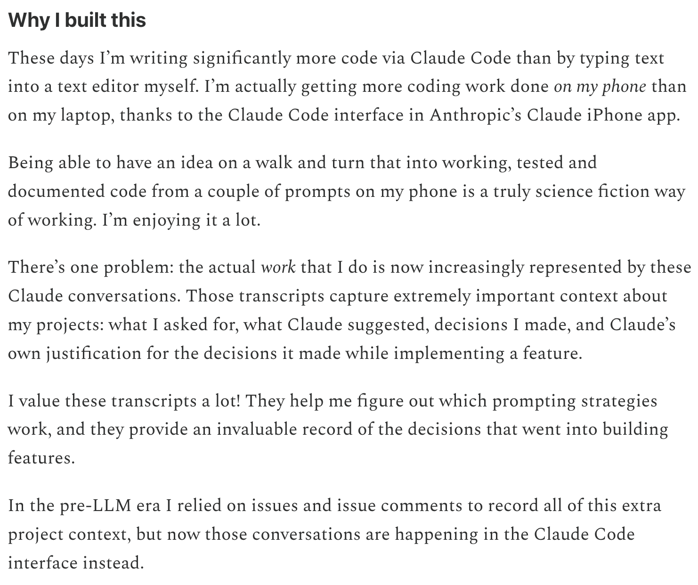

SimonW screenshot of recording claude code transcripts in git issues. Records entire transcript and converts it into html, human readable format. Link: https://simonw.substack.com/p/a-new-way-to-extract-detailed-transcripts ; Important: 

First public discourse on provenance: https://aicoding.leaflet.pub/3mcbiyal7jc2y

